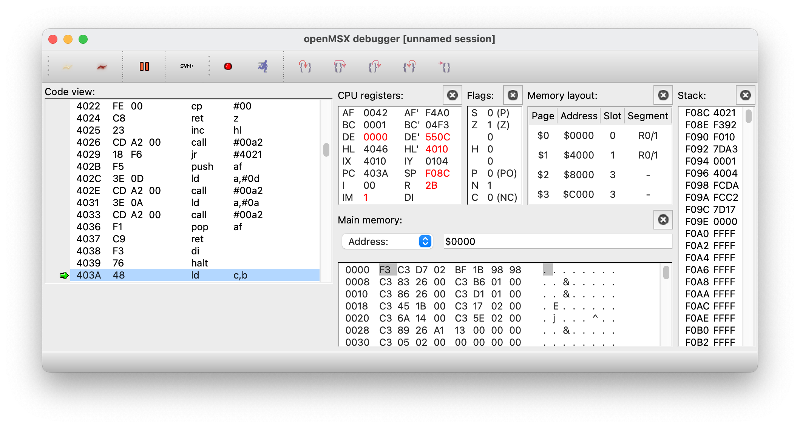

# Hello World: compile, run and debug on openMSX

_Gilbert Francois Duivesteijn_

[< Back to main page](index.html)


The picture above shows the final result on a real MSX, running from cartridge. Follow the steps below and you have it running yourself in minutes.


**Step 1**: Watch the tutorial from ChibiAkumas to know what the code is doing:

[Lesson H3 - Hello World on the MSX by ChibiAkumas](https://www.chibiakumas.com/z80/helloworld.php#LessonH3)


**Step 2**: Type in the code below and save to a file named `helloworld.asm`.  [Link to GitHub](https://github.com/gilbertfrancois/msx/tree/master/src/asm/01_helloworld)

```assembly
    ; org statement before the header
    org $4000

    ; ROM header
    db "AB"
    dw Main
    dw 0, 0, 0, 0, 0, 0

RomSize equ $4000
CHPUT   equ $00A2
CHMOD   equ $005f

FileStart:
Main:
		; set VDP to screen 0
		ld a, 0
		call CHMOD
		; print "Hello world" on screen
    ld hl, helloWorld
    call PrintStr
    call NewLn
    call Finished

PrintStr:
    ld a, (hl)
    cp 0
    ret z
    inc hl
    call CHPUT
    jr PrintStr

NewLn:
    push af
    ld a, 13
    call CHPUT
    ld a, 10
    call CHPUT
    pop af
    ret

Finished:
	di
	halt

helloWorld:
    db "Hello world!", 0

FileEnd:
    ds $4000 + RomSize - FileEnd, 255

```


**Step 3**: Compile

*with VASM*

```shell
$ vasmz80_oldstyle helloworld.asm -chklabels -nocase -Dvasm=1 -Fbin -L out.sym -o out.rom
```

*or with Glass (you can choose)*

```shell
$ java -jar Glass.jar helloworld.asm -L out.sym out.rom
```


**Step 4**: run with openMSX

```shell
$ <path to>/openmsx -machine C-BIOS_MSX1_EU -cart out.rom
```


**Step 5**: connect with openMSX Debugger

- Open the openMSX debugger
- Press `Connect`
- To see the symbols and have a better experience when stepping through the source file, click on `sym` button and add the file `out.sym`.
- Set breakpoints (if you want) and click in the menu on `System` -> `Reboot Emulator` 



---


**Step 6**: Flash a cartridge, the [MegaFlashROM](https://www.msxcartridgeshop.com) and run your program on a MSX like a pro:

- Copy the file out.rom to a microSD card

- Insert the microSD card in the MegaFlashRom, start your MSX.

- In the Nextor (MSX-DOS alike) prompt, type:

  ```shell
  B:> opfxsd out.rom
  ```

- Reboot the computer and.... congratulations with your first self created ROM on cartridge!

<video autoplay="autoplay" loop="loop" controls="control">
	<source src="assets/images/01_helloworld.mp4" type="video/mp4"/>  		
	Your Browser does not support the video element
</video>


- To erase the ROM on the cartridge, reboot the machine and hold the `arrow up` key. In the recovery mode, choose `F1 - Erase MegaFlashROM`. Now it is ready for your next program.

