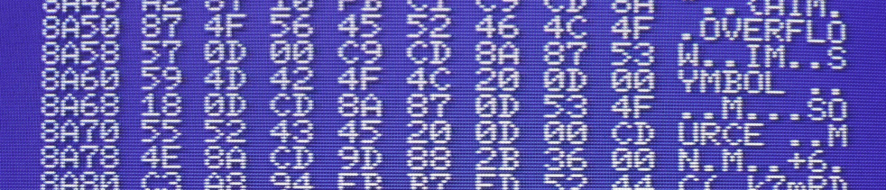

# How to create a ROM, BIN or CAS file

_Gilbert Francois Duivesteijn_

[< Back to main page](index.html)



When programming and compiling your assembly program, you have to choose how the program will be distributed. For each medium, the compiled binary requires a special header and sometimes a special footer. 

## ROM

The most simple template for creating a binary for a cartridge is given below. Note that the footer is there to pad the cartridge with value FF at the end of the binary, to give it a fixed file size. In this case, the ROM file is `$4000` bytes, 16kB.

```assembly
ORGADR  equ $4000
RomSize equ $4000

		; Place header inside the binary.
    org ORGADR
    ; ROM header
    db "AB"
    dw Main
    dw 0, 0, 0, 0, 0, 0

FileStart:
Main:
    ; Do something
FileEnd:
    ds $4000 + RomSize - FileEnd, 255
```

## BIN

A BIN file can be loaded and started automatically with `bload"myfile.bin",r` from disk. The header contains the beginning -, end -  and execution addresses of the binary. Unlike the ROM, the BIN format does not require padding at the end.

```assembly
ORGADR equ $c000

		; Place header before the binary.
		org ORGADR - 7
		; BIN header, 7 bytes
    db $fe
    dw FileStart
    dw FileEnd - 1
    dw Main
    ; org statement after the header
    org ORGADR

FileStart:
Main:
    ; Do something
FileEnd:
```

## CAS

The CAS template has the most complicated header file. The last part of the header is similar to that of the BIN template, but there are more magic numbers and the filename is included in the header. Note that the filename can contain only 6 characters.

I reverse engineered these 3 lines of magic numbers by using the TAPE2CAS tool and [dhex](http://www.dettus.net/dhex/).  Until now it always worked for me but I cannot guarantee that it is a generic, always working solution.

```assembly
ORGADR equ $c000

		; Place header before the binary.
		org ORGADR - 38
    ; CAS header with the filename, 38 bytes
    db $1f, $a6, $de, $ba, $cc, $13, $7d, $74
    db $d0, $d0, $d0, $d0, $d0, $d0, $d0, $d0, $d0, $d0
    db "hellow"
    db $1f, $a6, $de, $ba, $cc, $13, $7d, $74
    dw FileStart
    dw FileEnd - 1
    dw Main

    ; org statement after the header
    org ORGADR

FileStart:
Main:
    ; Do something
FileEnd:
```

