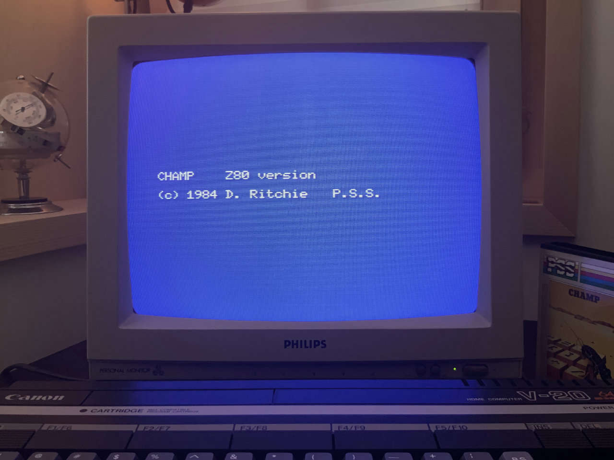

# Champ: Introduction and key bindings

*Gilbert François Duivesteijn*

[< Back to main page](index.html)

On these Champ pages, I try to explain how to use Champ for MSX(1) to write, store and deploy programs written in assembly or hybrid basic-assembly. Back in the days, around 1986 and beyond, I liked Champ a lot. It was easy to use, because it was an all-in-one editor, assembler, disassembler, monitor/debugger. On top of it, one could easily escape to basic to test the compiled program, which is still in memory and go back to Champ to do further programming. But the most killer feature was that you can step through code line by line, inspecting registers and memory values. 

*Fun fact: Champ has been created by the legendary [Dennis Ritchie](https://en.wikipedia.org/wiki/Dennis_Ritchie), the creator of the [C programming language](https://en.wikipedia.org/wiki/C_(programming_language)). By using this program, you work with legacy of computer history.*

The aim of this page is to show how you can develop and debug on a real MSX with only a cassette player/recorder as storage device, like it was done in the 80's with an MSX1 computer. If you don't have Champ, you can get it [here](https://download.file-hunter.com/Games/MSX1/CAS/Champ%20(1984)(PSS)%5BBLOAD'CAS-'%2CR%5D.zip). The manual is [here](champ_msx.pdf). Now insert your cassette in the datarecorder, type `bload"cas:",r` and let's have some fun!

|                           |                          |
| :-----------------------: | :----------------------: |
|       |  |
| Box, manuals and cassette |       Title screen       |

## Modes

Champ has 4 modes, Insert, Edit, Assemble and Debug. You can switch between the modes with the keys as described in the schema below.

---

 `< EDIT >`   &larr; `[ret]` &rarr;   `< INSERT >`

​          &uarr;

​     `[esc]`

​          &darr;

`< ASSEMBLE >`

                &uarr;

   `[m]`   `[a]`
 ​     &darr; 
   `< DEBUG >`

---
## Commands and keybindings

### `<ASSEMBLE>` mode commands

| Key   | Prompt        | Function                  |
| ----- | ------------- | ------------------------- |
| `F`   | `Find =>`     | Find a string             |
| `N`   | `Next =>`     | FInd a string             |
| `L`   | `Load =>`     | Load a source file        |
| `W`   | `Save =>`     | Save a source file        |
| `V`   | `Verify =>`   | Verify a source file      |
| `P`   | `Print =>`    | Print value of expression |
| `Q`   | `Quit =>`     | Quit to Basic             |
| `M`   |               | Enter `<DEBUG>`           |
| `esc` |               | Enter `<EDIT>`            |
| `A`   | `Assemble =>` | Assemble program          |

### Assembly options

|                                  |      |
| -------------------------------- | ---: |
| Syntax check only                |    0 |
| Display full list on screen      |   +1 |
| Load M/Code into memory          |   +2 |
| Copy screen to printer           |   +4 |
| Double line list                 |  +10 |
| Suppress display of symbol table |  +40 |

Note: These are hexadecimal numbers. Combining multiple options can be done by adding the hex option numbers.

### `<INSERT>` mode commands

Change between `<insert>` and `<edit>` mode by pressing `<enter>`. It takes a bit of time to get used to it. The edit mode has 3 colums:

| Label                                                        | Instruction                                                  | Operant                                                      |
| ------------------------------------------------------------ | ------------------------------------------------------------ | ------------------------------------------------------------ |
| String of max **6 characters**. A label does not require a colon. Press `[space]` if the line has no label. | Assembly language mnemonics as in Z80 specifications, 2 to 4 characters long. | Operants may be hex constants (preceded by `$`), labels symbols, or expressions. Decimal, octal and binary constants are not permitted. |

### `<EDIT>` mode commands

| Key          | Effect                                |
| ------------ | ------------------------------------- |
| `<up>`       | Move one line up                      |
| `<down>`     | Move one line down                    |
| `[ctrl] [u]` | Move up one page                      |
| `[ctrl] [d]` | Move down one page                    |
| `[ctrl] [t]` | Move to top of the source file        |
| `[ctrl] [b]` | Move to the bottom of the source file |
| `[ctrl] [z]` | Delete current line                   |
| `[esc]`      | Enters `<ASSEMBLE>` mode              |
| `[ret]`      | Enters `<INSERT>` mode                |

### `<DEBUG>` mode commands

| Command | Effect |
| :----- | :----- |
| @*addr* | Memory from the given *addr* onwards displayed, one byte at the time, in hex and ascii equivalent. Hit (RET) to advance to next byte, hit (ESC) to return to command level, or type a hex constant to replace the existing content of the byte. |
| `A` | Return to `<Assemble>` mode. |
| `D` *addr* *faddr* | Memory from the given address onwards is displayed in screen pages: hit any key to continue, or (ESC) to return to command level. |
| `F` *saddr* *faddr* *hx* | Every byte between *saddr* and *faddr* is filled with *hx*. |
| `K` | Print source and symbol table usage. |
| `M` *daddr* *saddr* *faddr* | The block of memory between *saddr* and *faddr* is copied to the block starting at *daddr*. |
| `Q` *addr* | Memory from *addr* onwards is disassembled. Hit (RET) to continue and (ESC) to return to command level. |
| `G` *addr* | The code starting at *addr* is executed (returnable). |
| `C` *addr* | Execute from *addr* (non-returnable) |
| `B`*n*=*addr* | A breakpoint number n (between 1 and 8) is set at *addr*, to cause a break in execution of any program which accesses the contents of *addr* as an instruction. Press (C)(RET) to continue from breakpoint. |
| `E`*n* | Eliminates breakpoint *n*. |
| `T` | Display the addresses of all breakpoints. |
| `R` *regname* | Displays the contents of a CPU register and accepts a new value (similar to the function of @ above). |
| `J` *addr* | Executes the code from *addr* onwards, one instruction at the time, giving a full register display. Hit (J) to continue, (ESC) to return to the command level. |
| `H` *expr* | Displays the decimal, hex and binary value of expr. |
| `S` *bytestr* | Searches the memory from $0000 onwards for every occurance of bytestr. |
| `N` chstr | As `S` above. |
| `W` | Load, save and verify machine code to tape. |

## References

[Champ (link to file-hunter)](https://download.file-hunter.com/Games/MSX1/CAS/Champ%20(1984)(PSS)%5BBLOAD'CAS-'%2CR%5D.zip)

[Champ MSX Users Manual](champ_msx.pdf)

[Champ ZX Spectrum Users Manual](champ_zxspectrum.pdf)

---

*Special note: A big "thank you" goes to [Denis Kovasevic](http://gems-lighted.com) who helped me with a replacement of my lost boxed version of Champ.*
