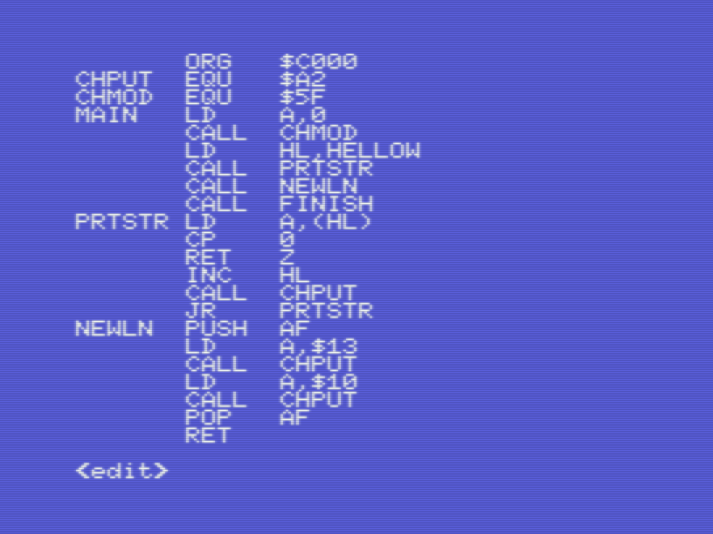
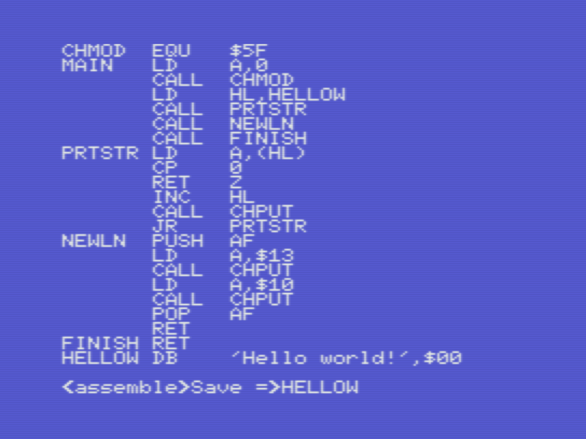
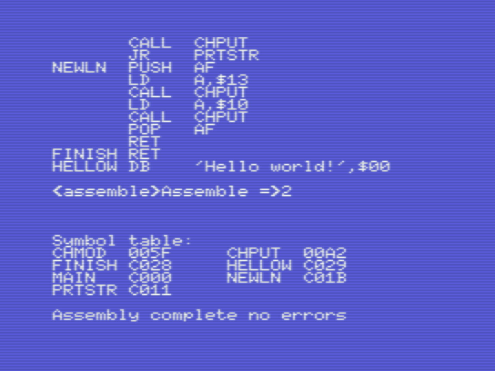
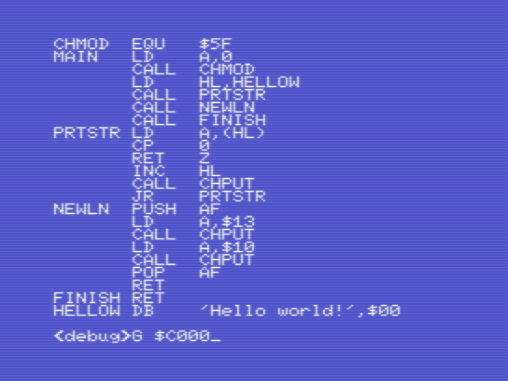
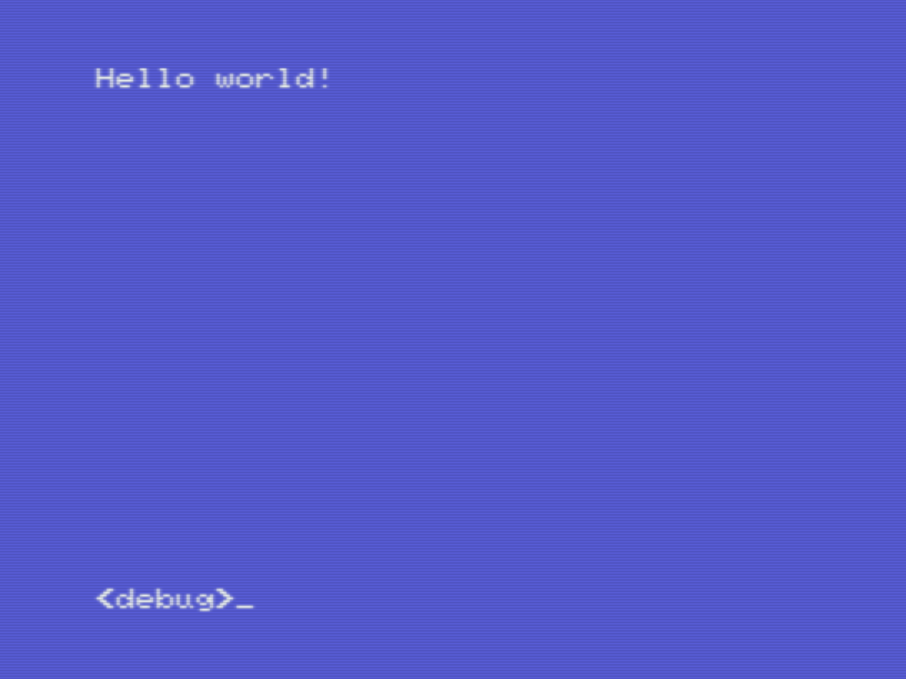
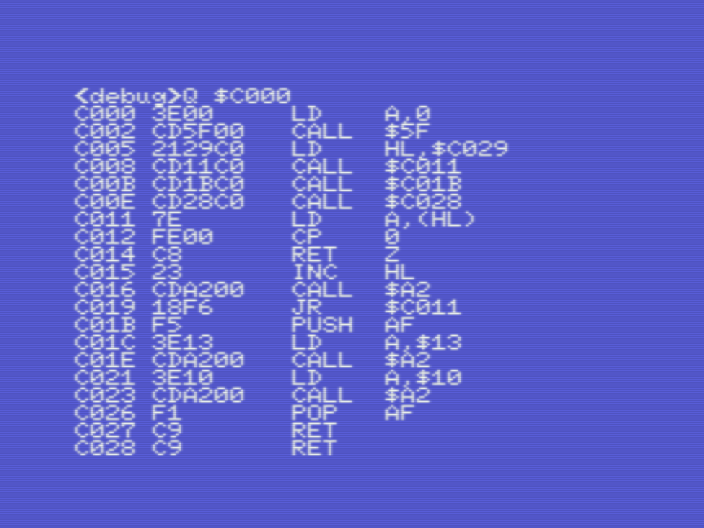
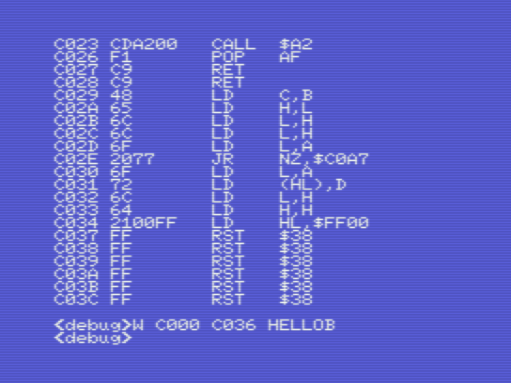
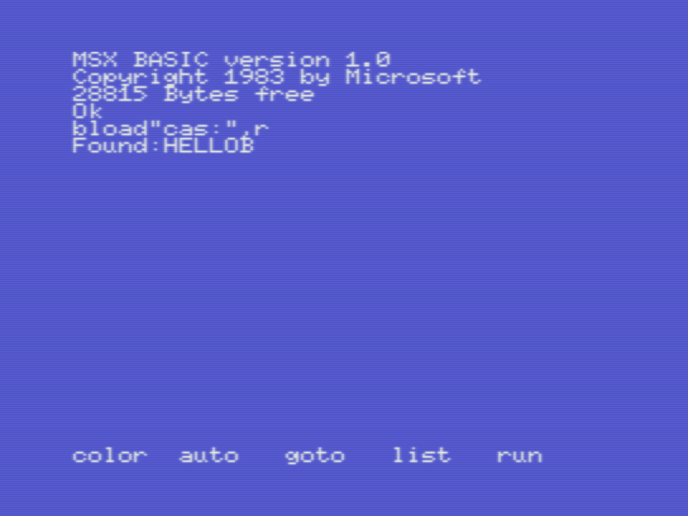
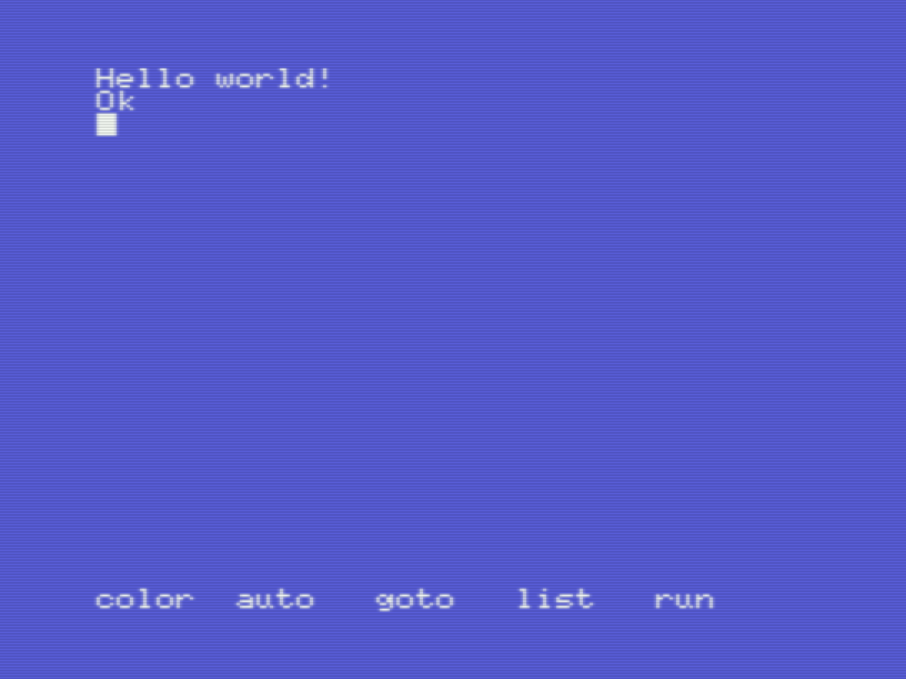

# Champ: Hello world!

_Gilbert Francois Duivesteijn_

[< Back to main page](https://gilbertfrancois.github.io/index.html)


The picture below shows the final result on a real MSX, loaded as binary from a cassette. Follow the steps below and you have it running yourself in minutes.


The tutorial is as close as possible equal to the version on a PC, described [here](01_helloworld_openmsx.html).


**Step 1**: Watch the tutorial from ChibiAkumas to know what the code is doing:

[Lesson H3 - Hello World on the MSX by ChibiAkumas](https://www.chibiakumas.com/z80/helloworld.php#LessonH3)


**Step 2**: Type in the code below and save to a file named `hellow.  (Link to Github)

```assembly
        ORG   $C000
CHPUT   EQU   $A2
CHMOD   EQU   $5f
MAIN    LD    A,0
        CALL  CHMOD
        LD    HL,HELLOW
        CALL  PRTSTR
        CALL  NEWLN
        CALL  FINISH
PRTSTR  LD    A,(HL)
        CP    0
        RET   Z
        INC   HL
        CALL  CHPUT
        JR    PRTSTR
NEWLN   PUSH  AF
        LD    A,$13
        CALL  CHPUT
        LD    A,$10
        CALL  CHPUT
        POP   AF
        RET
FINISH  RET
HELLOW  DB    'Hello world!',$00
```

Note the small differences, compared to the parallel example where we create a ROM. This binary will be loaded from tape. The ORG address is different and when the program finishes, we return to Basic, instead of calling the HALT instruction.

| Description                                                  | Screenshot                   |
| ------------------------------------------------------------ | ---------------------------- |
| Type in the code above... (note that the last lines in this screenshot are clipped). |  |
| Put in an empty cassette in the datarecorder. Go to `<assemble>` mode and press `S` followed by a 6 character long filename to store your *source code* to tape. |  |
| To compile the program, press `A`,`2`. For other options, refer to [Champ: First steps...](03_champ_1.html). |  |
| To run the program, press `ESC` to enter the `<debug>` mode. Note that we used $C000 as our org address, that will be the starting point to call our program. Type in `G $C000` to start and run the program. |  |
| Voila! It works. Because we started the program with the command `G`, we are back in Champ development environment when the program finishes. So ending our code with with RET instead of HALT is important here ;) |  |
| Finally, we want to save our binary to cassette, to be able to run it everywhere. To be able to do that, we need to find the end  address of our binary. Goto `<debug>` mode and list the program with `Q $C000`. |  |
| The format for saving a binary is: `W saddr faddr filename`. So in our case it will be `W C000 C036 HELLOB`, where hellob is a random chosen filename. |  |
| Moment of truth. The source file and binary file have been saved to tape. Let's **reset** the computer, **rewind** the tape and run our fresh made program: `bload"cas:",r` |  |
| Yay!                                                         |  |

