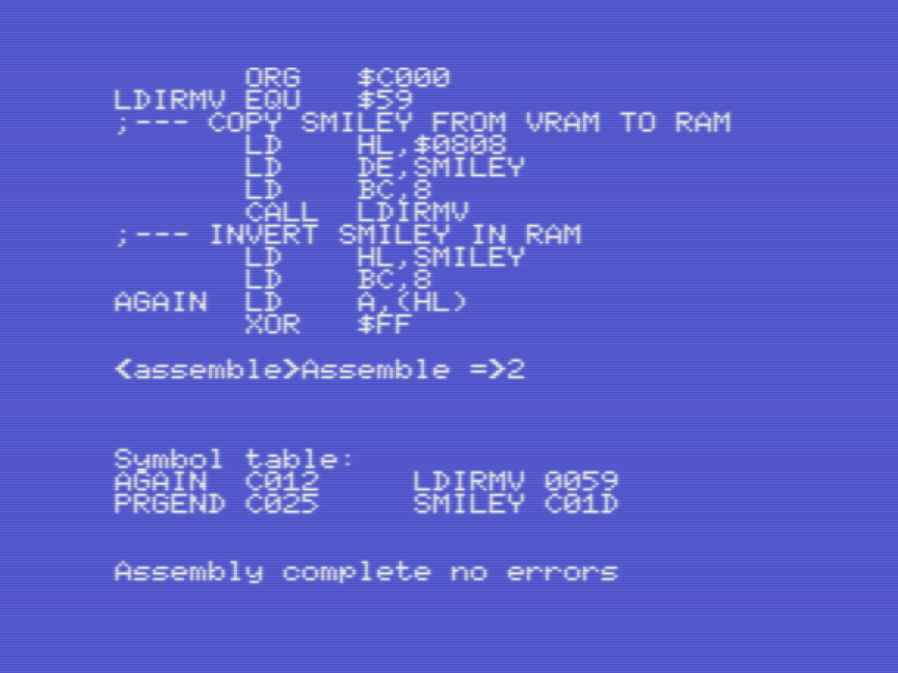
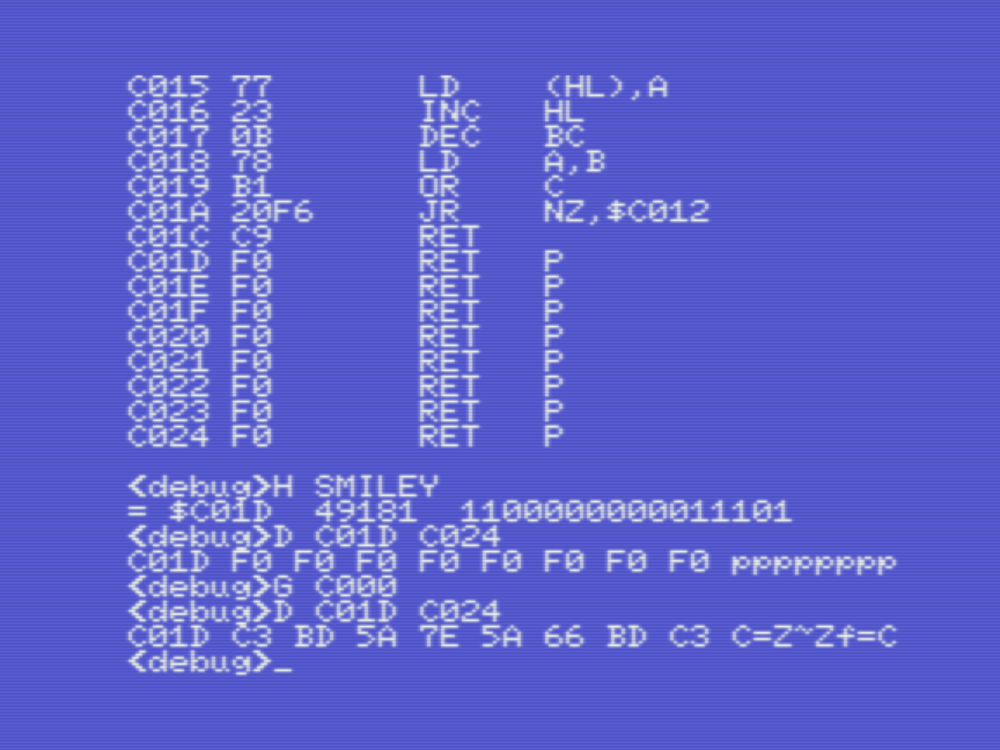

# Champ: Debug, set breakpoints, monitor registers, step though code

_Gilbert Francois Duivesteijn_

[< Back to main page](index.html)

This page shows how to use Champ for debugging, stepping through code, inspect registers and more. It is by far the most interesting page about champ on this website :) Let's start with typing in some code. The program is absolutely useless and does not do much. But it will help to demonstrate all the goodies that Champ has to offer as a complete development tool.

This code example does the following things:

- Initialize an array of 8 bytes in memory, labeled `SMILEY` with initial value %11110000 = $F0. This value has been chosen, so we can easily find it in memory when inspecting and debugging.
- Copies the smiley character from VRAM to RAM at position `SMILEY`,  using the bios function `LDIRMV`. 
- Invert the 8 bytes of `SMILEY`

- Return to Basic

The program does not give an output to screen. We can only observe the changes with the Champ Debugger.

<table>
    <tr>
        <td style="width: 50%;">Type in the listing or download it from the download section on this page. At the end, a <tt>ENDPROG</tt> label is added. This will help later when saving the binary to cassette. 
          To save the source, go to <tt>&lt;Assembly&gt;</tt> mode and type <tt>S DBGSRC</tt>. You can also download the source file at the bottom of the page, if you don't feel like typing it in yourself.</td>
        <td style="width: 50%;"></td>
    </tr>
  <tr>
    <td>In go to <tt>&lt;Assembly&gt;</tt> mode, compile the program with <tt>A</tt>, <tt>2</tt>. Note that the data array of <tt>SMILEY</tt> starts at <tt>$C01D</tt>, as shown in the symbol table.</td>
    <td></td>
  </tr>
</table>

## Memory monitor

<table>
  <tr>
    <td style="width: 50%;"><tt>D saddr [faddr]</tt>  
      To see the compiled program as bytes in memory, type . You can clearly see the reserved memory for our data array, 8 times <tt>$F0</tt>.</td>
    <td style="width: 50%;"></td>
  </tr>
</table>

## Disassembled code

<table>
  <tr>
    <td style="width: 50%;"><tt>Q saddr [faddr]</tt>  This shows the disassembled code, from the given start address. Go to next page by pressing <tt>enter</tt>.</td>
    <td style="width: 50%;"></td>
  </tr>
</table>

## Step through code, inspect registers and flags

<table>
  <tr>
    <td style="width: 50%;"><tt>J saddr</tt>, <tt>J</tt>, <tt>J</tt>...  
      The <tt>J saddr</tt> allows you to step through code line by line. Continue by pressing <tt>J</tt> to step into the next line. This view shows the registers, flags, program count, program listing, etc.  In this example on the left, you can see that the program has executed the first 3 lines of the code, loaded registers LH, DE and BC with values. When you press at this point another time <tt>J</tt>, the line <tt>CALL LDIRMV</tt> is executed and the labeled data array <tt>SMILEY</tt> is filled with new data.</td>
    <td style="width: 50%;"></td>
  </tr>
</table>

## Inspect variable

<table>
  <tr>
    <td style="width: 50%;"><tt>H label</tt>  
      To see the address of a label, type e.g. <tt>H SMILEY</tt>. The memory address of the label is then snown in HEX, DEC and BIN format. The value of the memory can be inspected with <tt>D saddr faddr</tt>. In the case of the example, where SMILEY is an array of 8 bytes:  
    <tt>H SMILEY</tt> 
    <tt>D $C01D $C024</tt>
      It shows the initial values of the array. Now run the program and inspect again the SMILEY array.  
    <tt>G $C000</tt> 
    <tt>D $C01D $C024</tt>  
    We see now that the array is filled with the inverted smiley.
    </td>
    <td style="width: 50%;"></td>
  </tr>
</table>

## Set breakpoint

<table>
  <tr>
    <td style="width: 50%;"><tt>Bn=addr</tt>  
      Set a breakpoint at given address, where <tt>n</tt> is a number between 1 and 8. E.g.  
      <tt>B1=C00C</tt>  
      A breakpoint is set just after the copy command from VRAM to RAM. When running the program from the start, it will stop at the breakpoint and show the register and program counter view.
    </td>
    <td style="width: 50%;"></td>
  </tr>
</table>

## List breakpoints

<table>
  <tr>
    <td style="width: 50%;"><tt>T</tt>  
      Show all breakpoints
    </td>
    <td style="width: 50%;"></td>
  </tr>
</table>

## Show all labels

<table>
  <tr>
    <td style="width: 50%;"><tt>D E000</tt>  
      Show all labels. Every label uses 8 bytes. The first 2 bytes indicate the memory address, the second 6 bytes are filled with the label name. Note that the labels are stored in human readible order (big endian). In the example on the left, we can see our own defined labels <tt>SMILEY</tt> (at address <tt>$C01D</tt>), <tt>AGAIN</tt> and <tt>PRGEND</tt>.
    </td>
    <td style="width: 50%;"></td>
  </tr>
</table>

## Clear memory, fill memory

<table>
  <tr>
    <td style="width: 50%;"><tt>F saddr faddr value</tt>  
      Most of the time, it can be helpful to clear the memory, before running the program again. To do that, you can use the fill command <tt>F</tt>. E.g. if we want to clear the memory, recompile the program, you can do: <tt>F C000 C0FF 00</tt>
    </td>
    <td style="width: 50%;"></td>
  </tr>
</table>

## Downloads

- [DBGSRC (Source code)](assets/downloads/champ_debug_src.wav)

