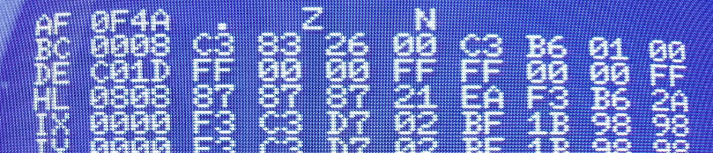
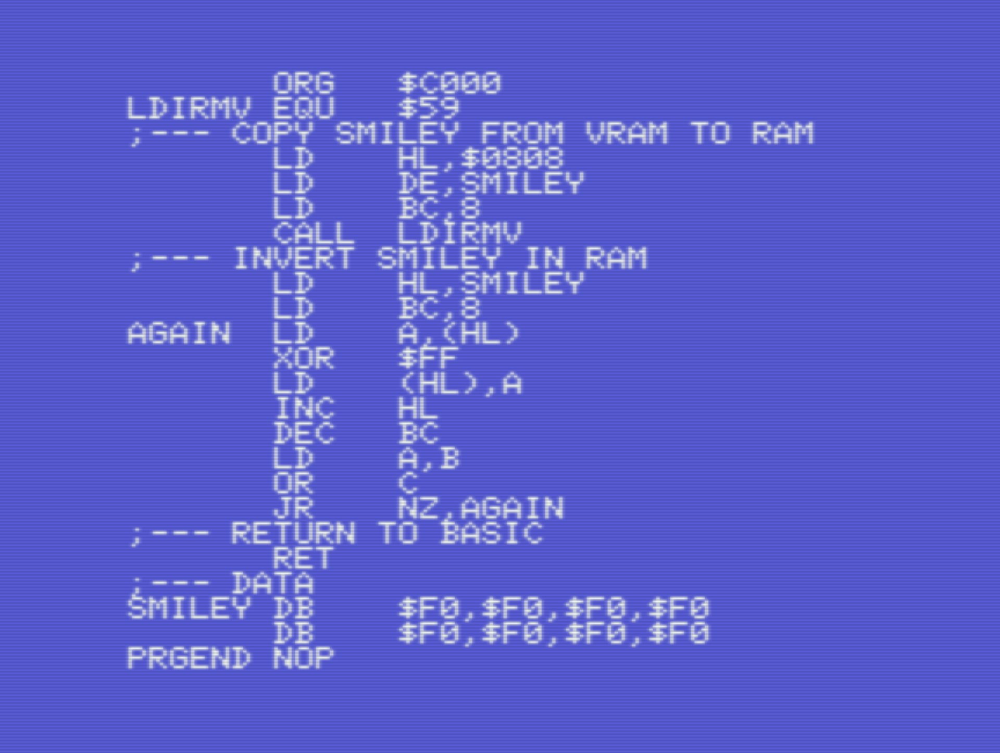
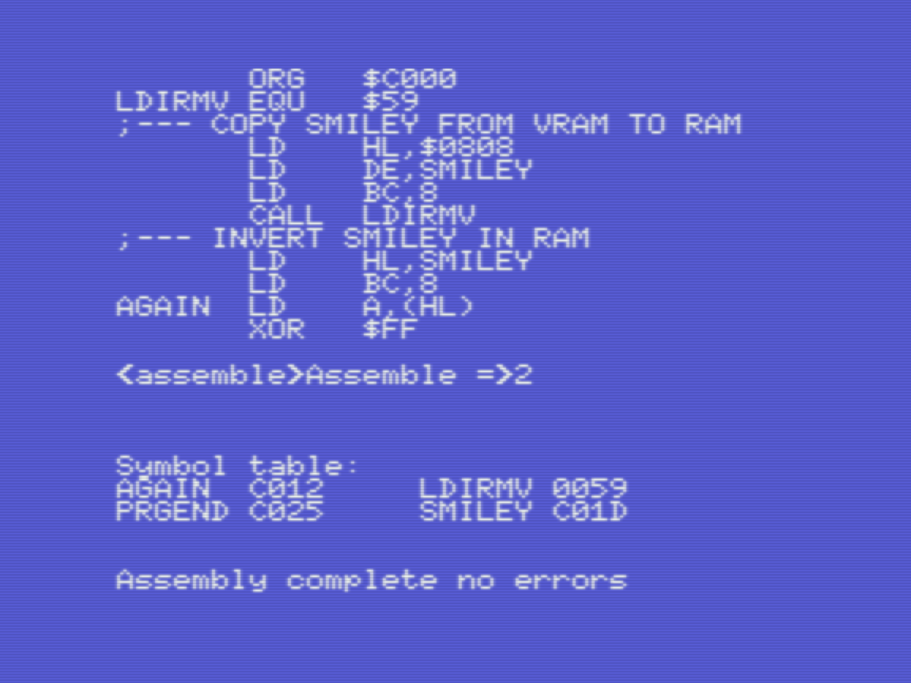
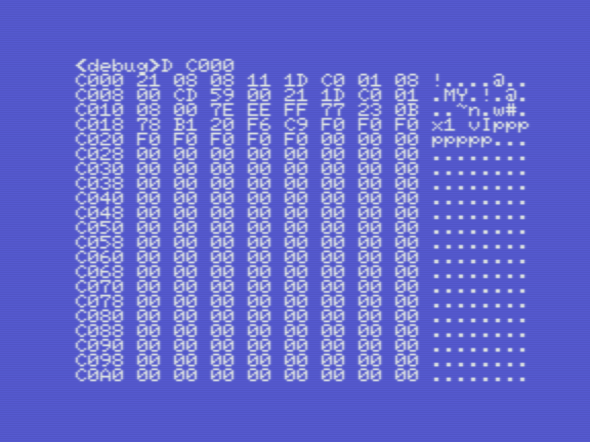
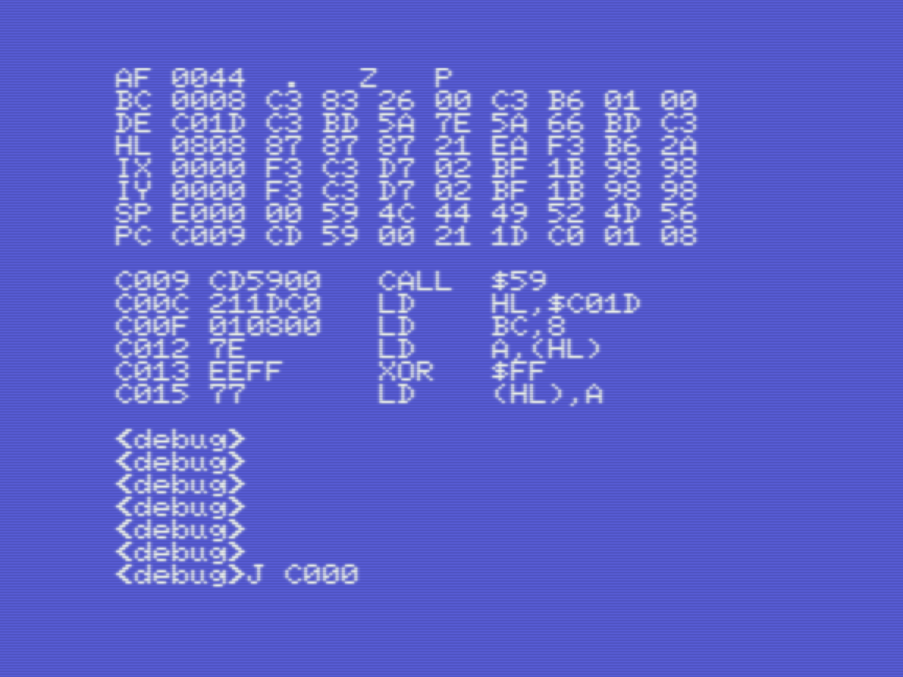

# Champ: Debug, set breakpoints, monitor registers, step though code

_Gilbert Francois Duivesteijn_

[< Back to main page](index.html)

This page shows how to use Champ for debugging, stepping through code, inspect registers and more. It is by far the most interesting page about champ on this website :) Let's start with typing in some code. Our test code is absolutely useless and does not do much. But it will help to demonstrate all the goodies that Champ has to offer as a complete development tool.

This code example does the following things:

- Initialize an array of 8 bytes in memory, labeled `SMILEY` with initial value %11110000 = $F0. This value has been chosen, so we can easily find it in memory when inspecting and debugging.
- Copies the smiley character from VRAM to RAM at position `SMILEY`,  using the bios function `LDIRMV`. 
- Invert the 8 bytes of `SMILEY`

- Return to Basic

The program does not give an output to screen. We can only observe the changes with the Champ Debugger.

<table>
    <tr>
        <td style="width: 50%;">Type in the listing or download it from the download section on this page. At the end, a <code>ENDPROG</code> label is added. This will help later when saving the binary to cassette. 
          To save the source, go to <code>&lt;Assembly&gt;</code> mode and type <code>S DBGSRC</code>. You can also download the source file at the bottom of the page, if you don't feel like typing it in yourself.</td>
        <td style="width: 50%;"></td>
    </tr>
  <tr>
    <td>In go to <code>&lt;Assembly&gt;</code> mode, compile the program with <code>A</code>, <code>2</code>. Note that the data array of <code>SMILEY</code> starts at <code>$C01D</code>, as shown in the symbol table.</td>
    <td></td>
  </tr>
</table>

## Memory monitor

<table>
  <tr>
    <td style="width: 50%;"><code>D saddr [faddr]</code>  
      To see the compiled program as bytes in memory, type . You can clearly see the reserved memory for our data array, 8 times <code>$F0</code>.</td>
    <td style="width: 50%;"></td>
  </tr>
</table>
...

## Step through code, inspect registers and flags

<table>
  <tr>
    <td style="width: 50%;"><code>J saddr</code>, <code>J</code>, <code>J</code>...  
      The <code>J saddr</code> allows you to step through code line by line. Continue by pressing <code>J</code> to step into the next line. This view shows the registers, flags, program count, program listing, etc.  In this example on the left, you can see that the program has executed the first 3 lines of the code, loaded registers LH, DE and BC with values. When you press at this point another time <code>J</code>, the line <code>CALL LDIRMV</code> is executed and the labeled data array <code>SMILEY</code> is filled with new data.</td>
    <td style="width: 50%;"></td>
  </tr>
</table>

