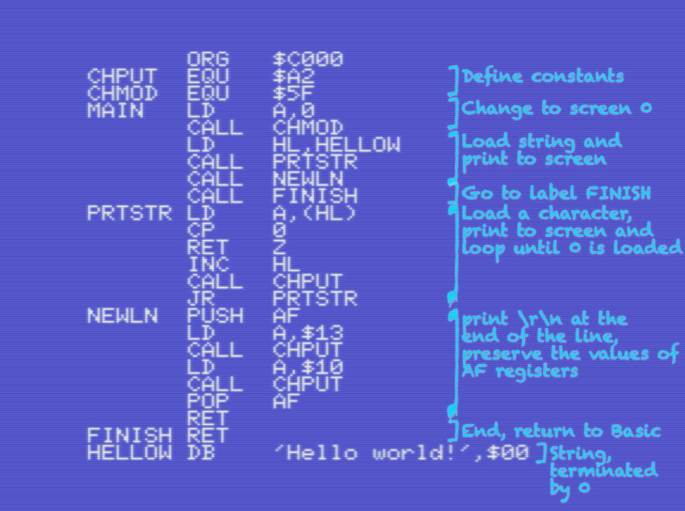
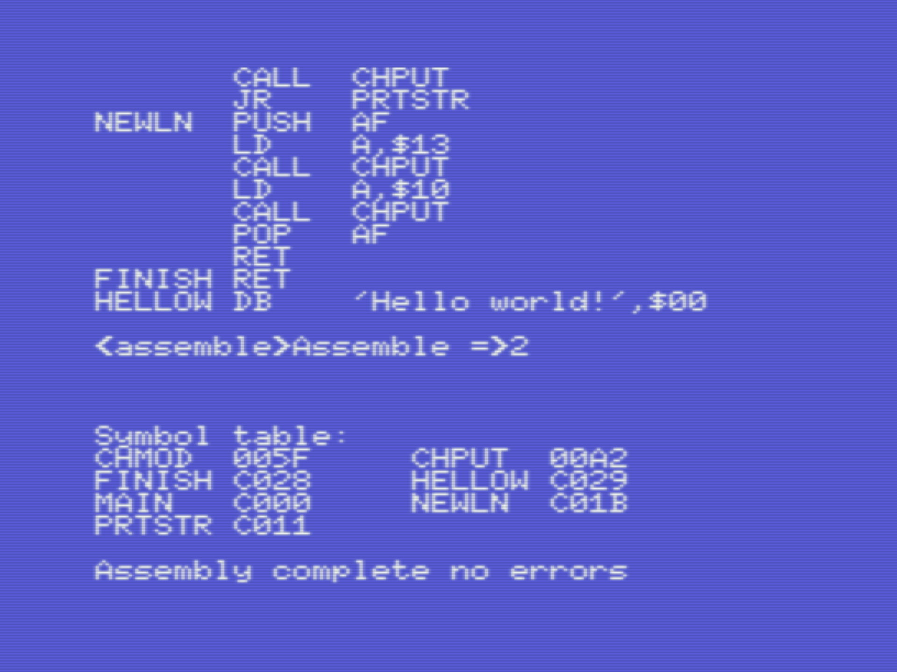
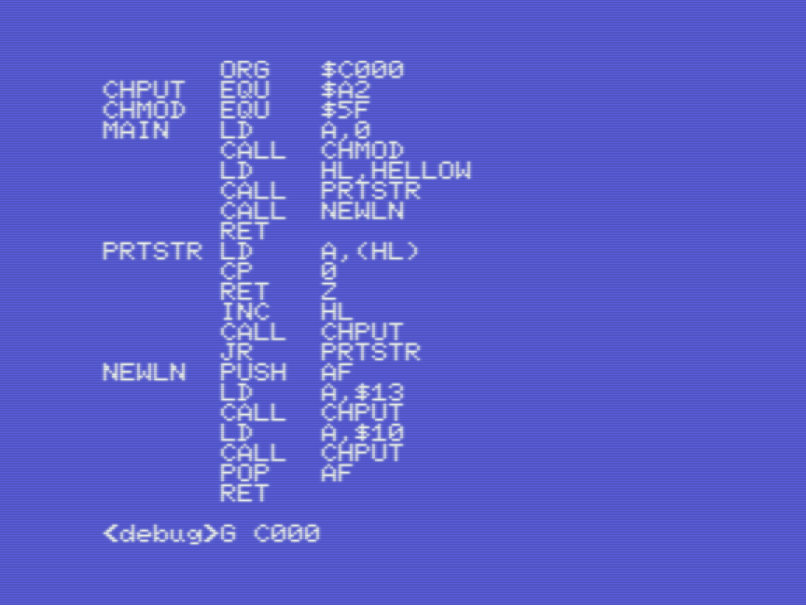
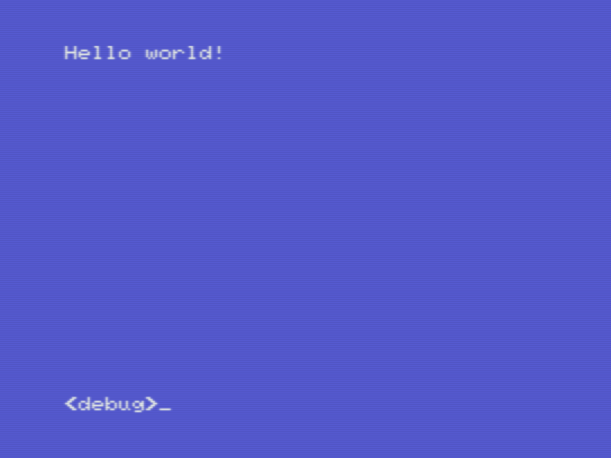
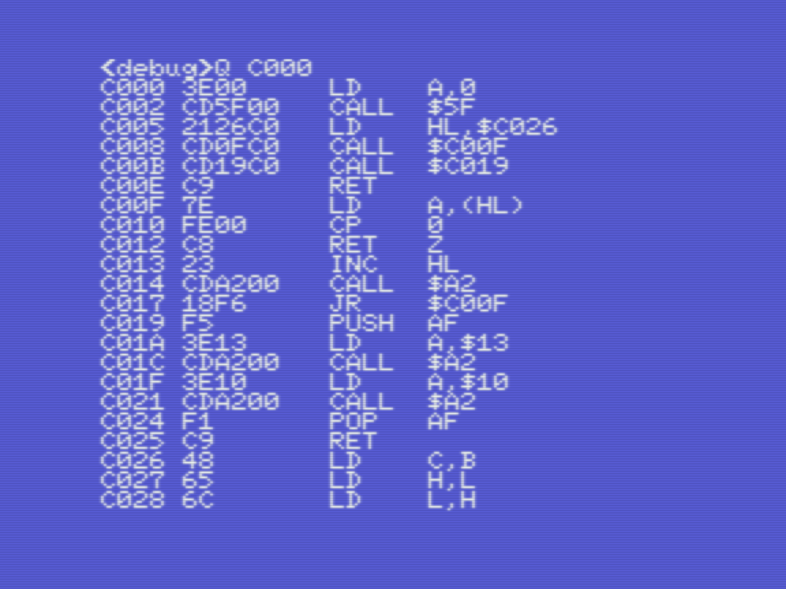
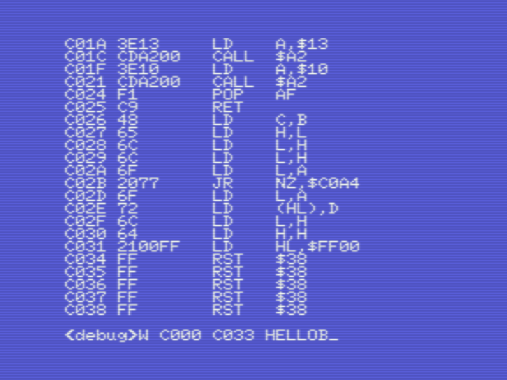
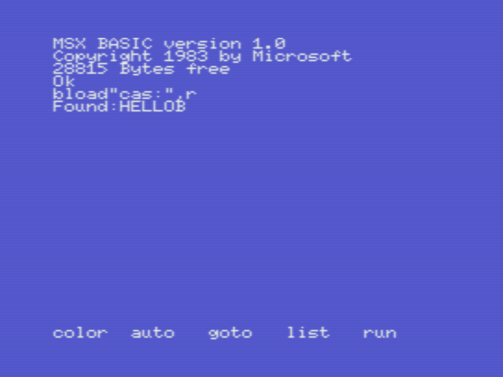

# Champ: Hello World, your first program, made on a real MSX1!

_Gilbert Francois Duivesteijn_

[< Back to main page](https://gilbertfrancois.github.io/index.html)

The picture above shows the final result on a real MSX, loaded as binary from a cassette. Follow the steps below and you have it running yourself in minutes.

The tutorial is as close as possible equal to the version cross-platform developed on a PC or Mac, described in [Hello World: compile, run and debug on openMSX, deploy on a real cartridge](01_helloworld_openmsx.html).

**Step 1**: Watch the tutorial from ChibiAkumas to know what the code is doing:

[Lesson H3 - Hello World on the MSX by ChibiAkumas](https://www.chibiakumas.com/z80/helloworld.php#LessonH3)

**Step 2:** Follow the description below...

| Description                                                  | Screenshot                                               |
| ------------------------------------------------------------ | -------------------------------------------------------- |
| Type in the code. Note the small differences, compared to ROM version mentioned earlier. This binary will be loaded from tape. The ORG address is different and when the program finishes, we return to Basic, instead of calling the HALT instruction. |         |
| Put in an empty cassette in the datarecorder. Go to `<assemble>` mode and press `S` followed by a 6 character long filename to store your *source code* to tape. |  |
| To compile the program, press `A`,`2`. For other options, refer to [Champ: First steps...](03_champ_1.html). |  |
| To run the program, press `ESC` to enter the `<debug>` mode. Note that we used $C000 as our org address, that will be the starting point to call our program. Type in `G $C000` to start and run the program. |  |
| Voila! It works. Because we started the program with the command `G`, we are back in Champ development environment when the program finishes. So ending our code with with RET instead of HALT is important here ;) |  |
| Finally, we want to save our binary to cassette, to be able to run it everywhere. To be able to do that, we need to find the end  address of our binary. Goto `<debug>` mode and list the program with `Q $C000`. |  |
| The format for saving a binary is: `W saddr faddr filename`. So in our case it will be `W C000 C036 HELLOB`, where hellob is a random chosen filename. |  |
| Moment of truth. The source file and binary file have been saved to tape. Let's **reset** the computer, **rewind** the tape and run our fresh made program: `bload"cas:",r` |  |
| Yay!                                                         |  |

If you're ready for using Champ in its full potential, check out [Champ: Debug, set breakpoints, monitor registers, step though code](03_champ_debug.html).

## Download links

- [HELLOW (source code)](assets/downloads/champ_helloworld_src.wav): WAV file with the source code. Record the sound to cassette and load it in Champ with the command `<ASSEMBLER> L => [ret]` .
- [HELLOB (binary code)](assets/downloads/champ_helloworld_bin.wav): WAV file with the binary. Record the sound to cassette and load it in MSX Basic with the command `bload"cas:",r`.

