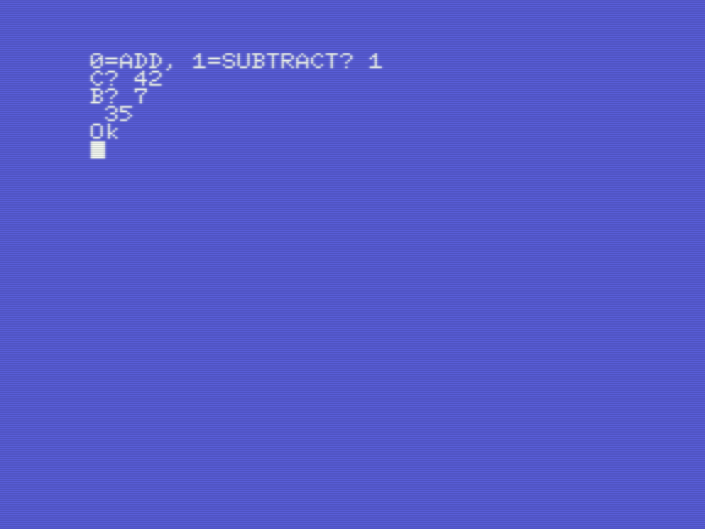
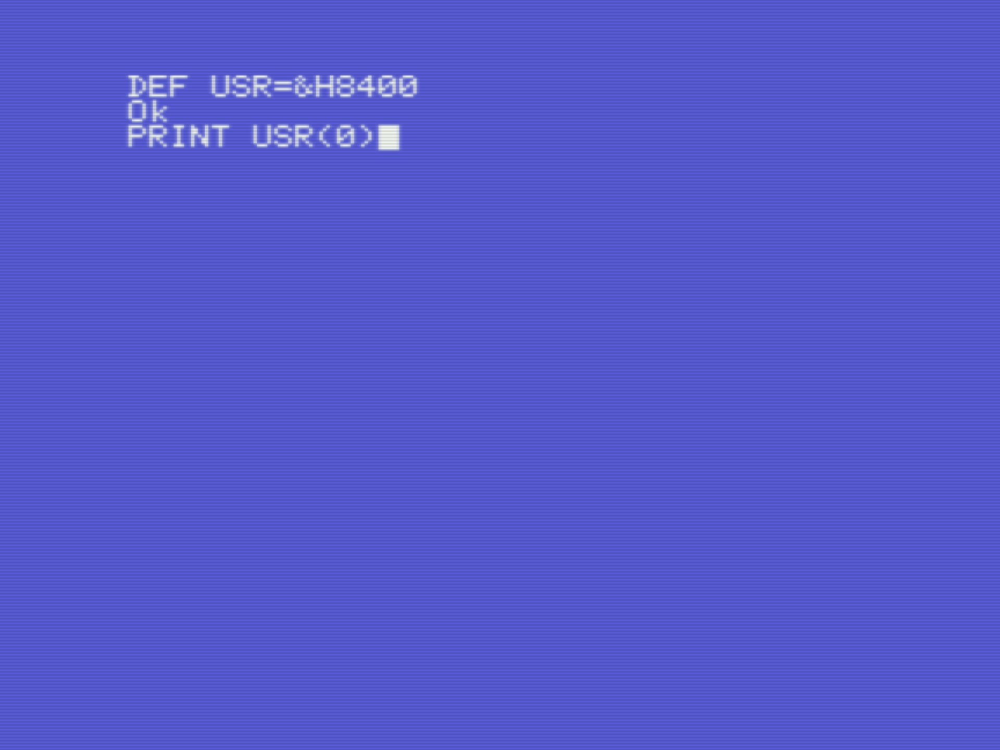

# Champ: Assembler -> Basic -> Assembler roundtrip

*Gilbert François Duivesteijn*

[< Back to main page](index.html)

This page shows how you can develop assembly code in Champ, use and test your program in Basic, and go back to Champ for further development. In this example, I loosly follow *ChibiAkumas'* tutorial [Learn Z80 Assembly Lesson 3](https://www.youtube.com/watch?v=zPXmvoZz9Nk&list=PLp_QNRIYljFq-9nFiAUiAkRzAXfcZTBR_&index=3). Please check out his lesson to learn what the code is doing.  We will make a small program in assembly that performs a naive *add* or *subtract* operation on single byte integers. We will make:

- Basic program that asks for the user input and shows the result.
- Assembly program that computes and stores the result in memory.

 Please follow the steps below:

| Instructions                                                 | Screenshots                                   |
| ------------------------------------------------------------ | --------------------------------------------- |
| Use **insert** and **edit** to type in the example program. To learn about the key bindings, please refer to this [page](03_champ_1.html). |  |
| In **assemble** mode, type `a` `2` to compile. Change cassettes to and save the listing as text to cassette with `s` -> `filename`. |  |
| Go to **debug** mode by pressing `m`, view the disassembled code in memory with `Q saddr`. If you want, you can store your finished binary to cassette with: `W saddr faddr filename`. |  |
| Go back to assemble mode by pressing `a`. Go back to basic with `q` `y` and type in the listing above. |  |
| If all is well, type `run` and see if your program works.    |  |
| You can go back to the Assembler by accessing the memory address **&H8400** and edit/update your asm program. |  |

