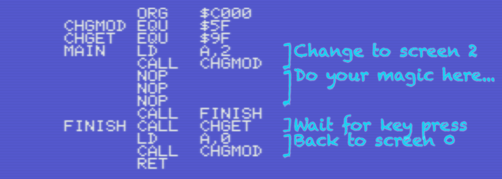

# Hello Screen2: VDP programming for MSX1

_Gilbert Francois Duivesteijn_

[< Back to main page](index.html)


The goal of this page is to show how to create graphics in screen mode 2. The examples in this page are the very minimum to create a tile, an 8x8 pixel sized block and copy the tile 2 times more using the pattern name table.

For more in-depth information about the code itself, read [Hello Screen2: VDP programming for MSX1](04_helloscreen2.html). This page is more focussed on how to develop it on a real MSX with Champ. There are **download links** for the source code (in Champ format) and binary at the bottom of the page.

## But first....

First read this and avoid problems later! Since Champ is running on the MSX, the same machine as your test code is running, you  have to take care of the following facts:

- *Always save your source code before running your program.* If your program has a bug and hangs, you will loose everything.

- When the program switches to a graphics mode, e.g. screen 2, you have to switch back to screen 0 in your code before the last `ret` instruction. If you don't do that, you have to reset your computer to bring it back to a working state again.

Let me give an example with comments: 

```assembly
        org   $c000
CHGMOD  equ   $005f
CHGET   equ   $009f

Main:
				; Change VDP mode to screen 2
				ld    a,2
        call  CHGMOD
        
        ; Do your screen2 magic here...
        
        call  Finish

Finish:
				; Wait for the user to press a key
				call  CHGET
				; Change VDP mode to screen 0
				ld    a, 0
				call  CHGMOD
				; Return to basic
				ret
```


In Champ, it will look something like in the screenshot below, where the **NOP** instructions stand for the body of the program.




## Implementation of Method 1

Here, the code example of [Hello Screen2: VDP programming for MSX1](04_helloscreen2.html) using method one is shown, how to enter the code and run it using Champ.

<table>
    <tr>
        <td style="width: 50%;"></td>
        <td style="width: 50%;"></td>
    </tr>
    <tr>
        <td>Type in the listing. Note that there are slight differences between this code and the one from the other "Hello Screen2" tutorial. First, Champ cannot have binary numbers. The data for the pattern PAT0 is in HEX. Second, when having arithmetics in the code, like in line containing <tt>LD HL, $1800 + $41</tt>, only <i>one</i> + or - sign is allowed. Third, at the end, a <tt>ENDPROG</tt> label is added. This will help later when saving the binary to cassette. When you don't want to type the code in yourself, you can download the source code on the bottom of this page.</td>
        <td></td>
    </tr>
    <tr>
        <td>In <tt>&lt;assemble&gt;</tt> mode, press <tt>S</tt> and give a filename to save the source to cassette.</td>
        <td></td>
    </tr>
    <tr>
        <td>In &lt;assemble&gt; mode, press <tt>A</tt>,<tt>2</tt>. Note that the label ENDPRG shows the address we need later.</td>
        <td></td>
    </tr>
    <tr>
        <td>Let's test and run the program. Press <tt>G C000</tt> where C000 is the start address of the program.</td>
        <td></td>
    </tr>
    <tr>
        <td>When all goes well, you will see the 3 tiles drawn in screen 2. Press any key to finish the program and to return to Champ.</td>
        <td></td>
    </tr>
    <tr>
        <td>It all seems to work well. Let's save the binary by dumping the block of memory to cassette. For that, we need to know the start and end addresses of the program. Since we made it easy for ourselves by adding a ENDPRG label at the end of the program, we can simply ask for the address by pressing <tt>H ENDPROG</tt>. </td>
        <td></td>
    </tr>
    <tr>
        <td>Make sure you have a cassette with free space on it and type: <tt>W C000 C04D HS2BIN</tt>. The file will be saved to cassette.</td>
        <td></td>
    </tr>
    <tr>
        <td>Reset the computer, rewind the tape and test the program if it runs. Type <tt>bload"cas:",r</tt> and wait what happens...</td>
        <td></td>
    </tr>
    <tr>
        <td>Success! Your program is ready to be shipped :)</td>
        <td></td>
    </tr>
</table>

In the next tutorial, we will look deeper into Champ on how to use the debugger and monitor.

## Resources

[HS2SRC (source code)](04_helloscreen2_src.wav)

[HS2BIN (binary code)](04_helloscreen2_bin.wav)