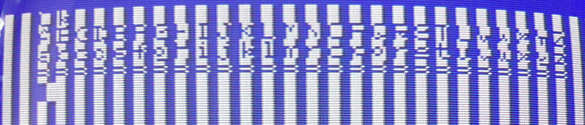
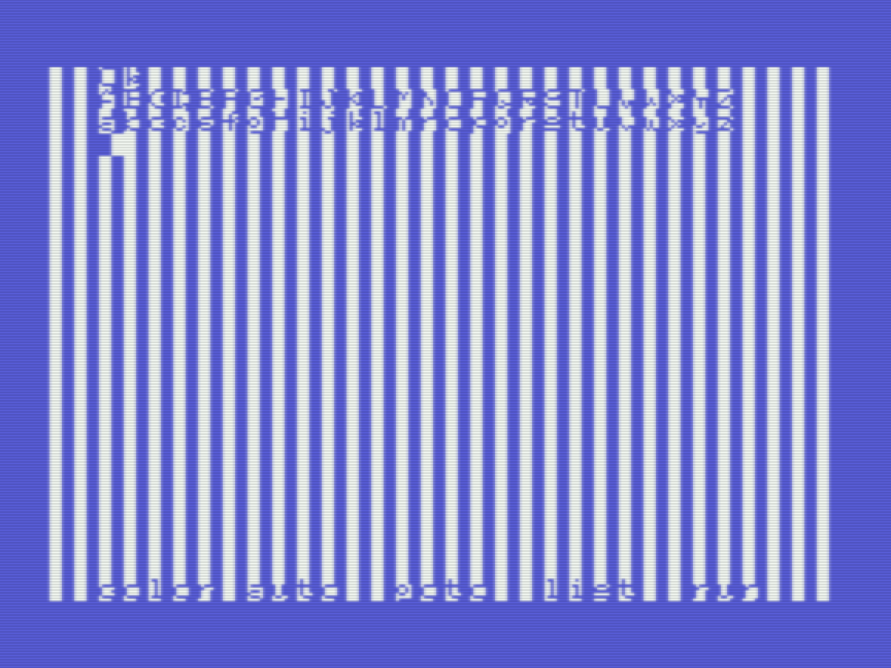

# Visualizing bit level operations

_Gilbert Francois Duivesteijn_



The tutorial [Lesson 5 - Bit level operations, Self modifying code](https://www.chibiakumas.com/z80/index.php#Lesson5) of ChibiAkumas shows well the bit operations on the screen. This is shown on an Amstrad CPC and there, the video memory is directly accessible. To do the same on an MSX, we need to do a bit more steps:

- Copy (part of) the video memory to RAM.
- Do the operations we want...
- Copy the altered bytes back to VRAM

Below is a small example of this (as BIN file). 

**Step 1**: Type in the source code on a PC or Mac:

```assembly
    db $FE
    dw FileStart
    dw FileEnd - 1
    dw Main

    ; org statement after the header
    org $c000

CHGMOD      equ $005f
; Function : Switches to given screenmode
; Input    : A  - screen mode
; Registers: All

LDIRVM      equ $005c
; Function : Block transfer from memory to VRAM 
; Input    : BC - blocklength
;            DE - Start address of VRAM
;            HL - Start address of memory
; Registers: All

LDIRMV      equ $0059
; Function : Block transfer from VRAM to memory 
; Input    : BC - blocklength
;            DE - Start address of memory
;            HL - Start address of VRAM
; Registers: All

VDPData     equ $98
VDPControl  equ $99
VramCache   equ $c400

FileStart:
Main:
    ; Go to screen 1
    ld a, 1
    call CHGMOD

    ; Make a copy of the pattern table in RAM.
    ld hl, $0000
    ld de, VramCache
    ld bc, $0800
    call LDIRMV

    ;============================================================ 
    ld hl, VramCache  ; Start of the cache in RAM
    ld bc, $0800      ; Block size: 256 characters * 8 byte
Again:
    ld a, (hl)
    ; uncomment one of the 3 lines below to see the effect
    ; and %1111000    ; keep bits that are 1
    ; or %11110000    ; set bits that are 1
    xor %11110000     ; invert bits that are 1     
    ld (hl), a
    inc hl
    dec bc
    ld a, b
    or c
    jr nz, Again      ; loop over given block size
    ;============================================================ 

    ; Copy to the pattern table in VRAM
    ld hl, VramCache
    ld de, $0000
    ld bc, $0800
    call LDIRVM
    
    ret

FileEnd:

```

**Step 2**: *Compile  with Glass (or another assembler of your choice)*

```shell
$ java -jar Glass.jar bitleveloperations_bin.asm -L out.sym out.rom
```

**Step 3**: run with openMSX. Set the floppy drive to the build directory and in MSX Basic type:

```sh
bload"out.bin"
```

**Step 4**: Run your program. In basic, type:

```
def usr=&hc000
a=usr(0)
```



Congrats, you have a template for your ChibiAkumas tutorial. Change the code between the `====` lines and ... happy learning!