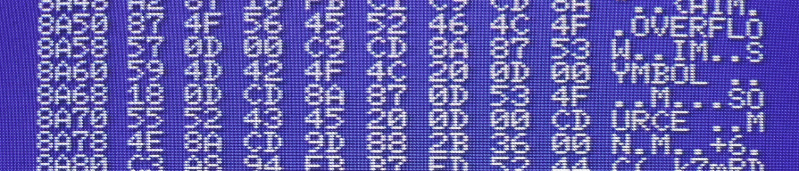

# Hooks and interrupts

_Gilbert Francois Duivesteijn_

[< Back to main page](index.html)




## VDP (vblank) interrupt

If you want your program to run something in sync with the refresh rate of the screen, you can use the vblank interrupt. The way to call your function at the interrupt is to use the hook which is a fixed memory address, where 5 bytes are reserved for every hook. Normally they are filled with RET but you can replace these bytes with e.g. a `JP addr` command that points to your function.

This page [MSX Wiki: System hooks](https://www.msx.org/wiki/System_hooks) gives an overview of all possible hooks.

A recommended way to use hooks is:

- Make a copy of the current hook. Especially on disk systems, you cannot assume that e.g. the HTIMI hook is empty.
- Place a `jp addr` instruction at the place of the hook, pointing to your subroutine.
- Inside your subroutine, run your code, followed by a `jp old_hook_add` command.

The example below is a minimal example, that gives a BEEP every second on a 50Hz machine.

```assembly
; Simple interrupt test
; Credits and references: 
;    https://msx.org/forum/msx-talk/development/question-about-htimi-hook-fd9fh 
;    https://msx.org/forum/msx-talk/hardware/way-detect-vblank-time
;    https://www.youtube.com/watch?v=aUkHk_mjtOU

    ; BIN header
    db $FE
    dw FileStart
    dw FileEnd - 1
    dw Main

    ; org statement after the header
    org $C000

BEEP     equ $00c0
HTIMI    equ $fd9f
MaxCount equ 50

FileStart:
Main:
    ; Install hook, run once
    di
    ; Preserve old hook
    ld de, OldHook
    ld hl, HTIMI
    ld bc, 5
    ldir
    ; Install new hook
    ld a, $c3              ; jp instruction opcode
    ld (HTIMI), a          ; Set jp instruction into the hook memory address
    ld hl, BeepFn          ; Load BeepFn addr
    ld (HTIMI+1), hl       ; Set BeepFn memory addr after jp instruction
    ei                     ; enable interrupts
    ret

BeepFn:
    ; Run at every interrupt
    ld hl, Counter
    dec (hl)
    ld a, (hl)
    jp nz, OldHook
    ; Reset counter and call BEEP
    ld (hl), MaxCount
    call BEEP


OldHook:
    db 0, 0, 0, 0, 0

Counter:
    db MaxCount

FileEnd:
```

Compile with:

```shell
$ java -jar Glass.jar beep.asm -L out.sym out.bin
```


## References and credits

- [MSX Wiki: System hooks](https://www.msx.org/wiki/System_hooks)
- [MSX forum: question about htimi hook](https://msx.org/forum/msx-talk/development/question-about-htimi-hook-fd9fh)
- [MSX forum: way detect vblank time](https://msx.org/forum/msx-talk/hardware/way-detect-vblank-time)
- [MSX Inside 006-INTERRUPCIONES VBLANK](https://www.youtube.com/watch?v=aUkHk_mjtOU)