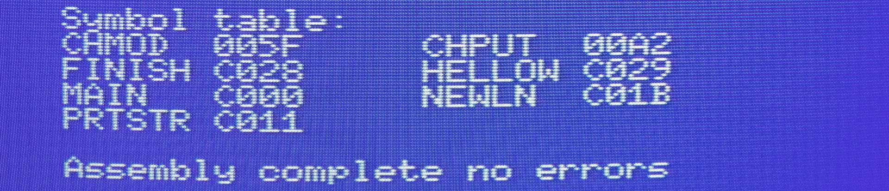

# Journey into MSX Z80 Assembly programming

_Gilbert François Duivesteijn_

## Abstract

I started these pages to document my journey into programming with assembly for the MSX1. I made personal notes and decided to put them online. It is hard to start, to learn and choose the right tools. Although there are plenty of very good resources on the web, most of them assume that you already have a good working development environment or basic knowledge about assembly for the Z80. 

The *"Hello world"* and *"Hello Screen2"* pages will take you step by step in getting your first lines of code compiled and working in an emulator *and* on a real MSX. But most of the pages will be more like a *"cookbook" setup*, showing one small topic, a technique or snippet on how to do something.  

I think what is missing on the internet is knowledge of how to develop directly on a real MSX, especially on an MSX1. Most development tools that run on native hardware are for MSX2 only. The *"Champ: ..."* pages will show you how you can develop on an MSX1, like it was done in 1984. It's fun!

#### What you need

For developing for MSX on a PC or Mac (cross platform development), you need

- a text editor, it can be [anything](https://neovim.io) you like,

- an assembler, e.g. [VASM](http://www.compilers.de/vasm.html) or [Glass](http://www.grauw.nl/projects/glass/),
- an emulator, e.g. [openMSX](https://openmsx.org), optionally with [openMSX Debugger](https://openmsx.org).

For developing for MSX on a real MSX1, I recommend

- [Champ, by PSS](https://download.file-hunter.com/Games/MSX1/CAS/Champ%20(1984)(PSS)%5BBLOAD'CAS-'%2CR%5D.zip). It has a build in editor, debugger and monitor, all running on a MSX1.  

## Howto's: Cross platform development

- [Hello World: compile, run and debug on openMSX, deploy on a real cartridge](01_helloworld_openmsx.html)
- [Hello Screen2: VDP programming for MSX1](04_helloscreen2.html)
- [How to create a ROM, BIN or CAS file](02_rombincas.html)
- [Updating variables when compiling as ROM](05_romvar.html)
- [Visualizing bit level operations](07_bitleveloperations.html)

## Howto's: Development on a real MSX1

- [Champ: Introduction and key bindings](03_champ_intro.html)
- [Champ: Hello World, your first program, made on a real MSX1!](03_champ_helloworld.html)
- [Champ: Hello Screen2: VDP programming for MSX1](03_champ_screen2.html)
- [Champ: Assembler -> Basic -> Assembler roundtrip](03_champ_roundtrip.html)
- Champ: Debug, set breakpoints, monitor registers, step though code.  *(Coming soon!)*

 

## My other personal pages

- [Gilbert Francois Photography](https://www.gilbertfrancois.com)
- [BLiTzBLiT :: Generative Art and more...](https://www.blitzblit.com)

- [github / gilbertfrancois](https://www.github.com/gilbertfrancois)

- [Hackaday projects](https://hackaday.io/gilbertfrancois)

## References

- [Learn Multi platform Z80 Assembly Programming... With Vampires!](https://www.chibiakumas.com/z80/z80_2021.php)
- [MSX2-Technical-Handbook](https://konamiman.github.io/MSX2-Technical-Handbook/)
- [MSX Assembly Page](http://map.grauw.nl)
- [MSX wiki](https://www.msx.org/wiki/Category:Programming#Programming_Software)
- [Z80 Assembly - Gergely Patai](https://tutorials.eeems.ca/Z80ASM/index.htm)
- [Practical MSX machine code programming, Steve Webb](https://archive.org/details/practical_msx_machine_code_programming_steve_webb)
- [Programming the Z80, Zaks](https://www.amazon.com/Programming-Z80-Rodnay-Zaks/dp/0895880695)
- [Learn Multiplatform Assembly Programming with ChibiAkumas, Volume 1](https://www.amazon.com/Learn-Multiplatform-Assembly-Programming-ChibiAkumas/dp/B08W7DWZB3/)
- [Learn Multiplatform Assembly Programming with ChibiAkumas, Volume 2](https://www.amazon.com/Learn-Multiplatform-Assembly-Programming-ChibiAkumas/dp/B09VWHYDKJ/)
- [Z80 Assembly Language Programming, Leventhal](https://www.amazon.com/gp/product/0931988217/)

