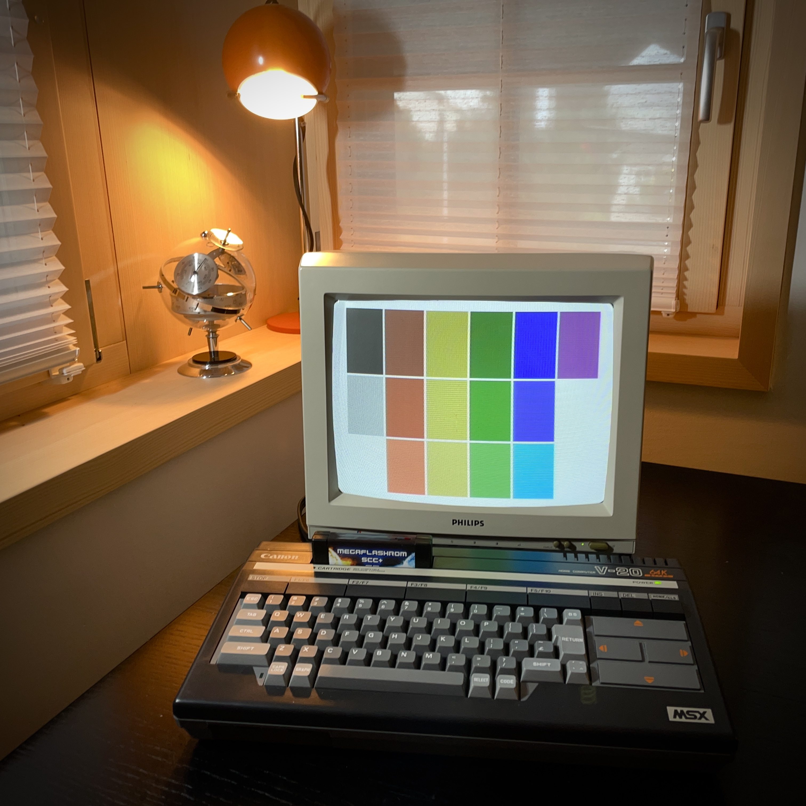

# MSX Assembly page for beginners

_Gilbert François Duivesteijn_

## Abstract

I started these pages to document my journey into programming with assembly for the MSX1. It is hard to start, to learn and choose the right tools. Although there are plenty of very good resources on the web, most of them assume that you already have a good working development environment or basic knowledge about assembly for the Z80. The first pages will be about getting your first code compiled and working in an emulator and even on a real MSX. I think what is missing on the internet is knowledge of how to develop directly on a real MSX, especially on an MSX1. These pages will show you how you can do that. It's fun!

The page won't go deep into learning actual assembly. There are excellent resources for that. I can recommend you to look at:

- [Learn Multi platform Z80 Assembly Programming... With Vampires!](https://www.chibiakumas.com/z80/)
-  [MSX2-Technical-Handbook](https://konamiman.github.io/MSX2-Technical-Handbook/)

- [MSX Assembly Page](http://map.grauw.nl)

- [MSX wiki](https://www.msx.org/wiki/Category:Programming#Programming_Software)

### Developing with ASM on modern hardware

For developing on a PC or Mac, you need

- a text editor, it can be [anything](https://neovim.io) you like,

- an assembler, e.g. [VASM](http://www.compilers.de/vasm.html) or [Glass](http://www.grauw.nl/projects/glass/),
- an emulator, e.g. [openMSX](https://openmsx.org), optionally with [openMSX Debugger](https://openmsx.org).

### Developing with ASM on a real MSX1

- [Champ, by PSS](https://download.file-hunter.com/Games/MSX1/CAS/Champ%20(1984)(PSS)%5BBLOAD'CAS-'%2CR%5D.zip). For me, it  was the best assembler for MSX1. It has a build in editor, debugger and monitor, all running on a MSX1. Fun fact: Champ has been created by the legendary [Dennis Ritchie](https://en.wikipedia.org/wiki/Dennis_Ritchie), the creator of the [C programming language](https://en.wikipedia.org/wiki/C_(programming_language)).

 

## Chapters

- [Hello World: compile, run and debug on openMSX](01_helloworld_openmsx.html) 
- [How to create a ROM, BIN or CAS file](02_rombincas.html)

